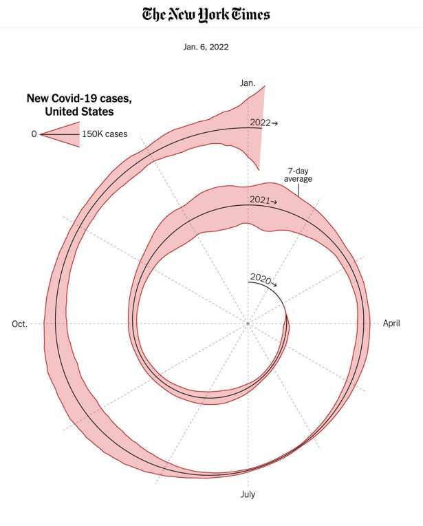
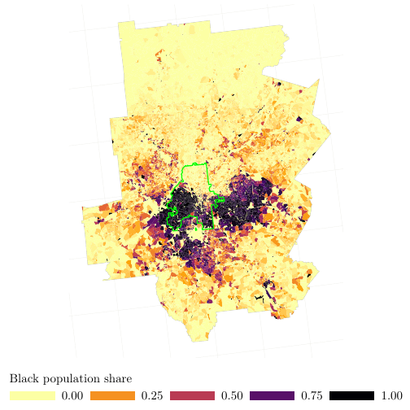

```{css, echo=FALSE}
# CSS for including pauses in printed PDF output (see bottom of lecture)
@media print {
  .has-continuation {
    display: block !important;
  }
}
```

```{css, echo=FALSE}
.center-fit {
  display: block;
  margin-left: auto;
  margin-right: auto;
  max-width: 80%;
  max-height: 10%;
}
```


```{r setup, include=FALSE}
# xaringanExtra::use_scribble() ## Draw on slides. Requires dev version of xaringanExtra.

options(htmltools.dir.version = FALSE)
library(knitr)
opts_chunk$set(
  fig.align="center",  
  fig.height=4, #fig.width=6,
  # out.width="748px", #out.length="520.75px",
  dpi=300, #fig.path='Figs/',
  cache=T#, echo=F, warning=F, message=F
  )

knitr::opts_chunk$set(echo=TRUE, eval=TRUE,results='hide')

Sys.setenv(lang='en')
setwd(dirname(rstudioapi::getActiveDocumentContext()$path))
library(tidyverse)
library(hrbrthemes)
library(fontawesome)
library(tidyverse)
library(ggtext)
library(lubridate)
library(here)
library(magick)
```


# Lecture's Objectives

1. [Why this course?](#motivation)

2. [Getting started](#started)

3. [What R can do?](#r4ds)

4. [Basic Introduction](#introduction)


---
class: inverse, center, middle
name: motivation

# Why this course?

<html><div style='float:left'></div><hr color='#EB811B' size=1px width=796px></html>

---

# What is R?

- R is a language and environment for statistical computing and graphics.
- **Open-source** and extensible.
- Built upon _S_, a statistical programming language.
- Rich set of packages for data manipulation (e.g., `tidyverse` environment build upon `tidyr`, `dplyr`, etc.).
- Comprehensive plotting libraries (e.g., `ggplot2`, `lattice`).
- Wide array of statistical tests.
- Facilitates machine learning algorithms.
- Excellent packages (e.g., `sf`, `terra`, etc.) for spatial datasets and GIS applications

---


# Comparison with other languages


## R vs Python

- R: More focused on statistical modeling and data visualization.
- R: Weaker on web-scraping
- Python: More general-purpose but has strong data science libraries (e.g., `pandas`, `scikit-learn`).

## R vs MATLAB

- R: Open-source and has a larger community for data science.
- MATLAB: Stronger in numerical simulation but less versatile for data manipulation.


---

#  R vs STATA

## Flexibility and Extensibility

- **R**: Highly extensible through packages; good for custom statistical methods.
- **STATA**: More rigid but user-friendly for standard statistical tests.

## Data Handling

- **R**: More versatile data manipulation capabilities (`dplyr`, `tidyr`).
- **STATA**: Efficient for large datasets but less flexibility.

## Graphics and Visualization

- **R**: Advanced graphical capabilities (`ggplot2`).
- **STATA**: Basic graphs are easier to produce but less customizable.

### Pricing and Community

- **R**: Open-source, large and active community.
- **STATA**: Commercial software, smaller community focused on social sciences.

---


# So, Why This Course?

- Provide a basic introduction to R
- In future, extend the course to advance level (_depending upon demand_)
  - Causal inference methods
  - Big data (`vroom`)
  - Webscraping 
  - Geospatial analysis
  - ...
--

- Many of these topics are not directly relevant for your specific work, but,

--

> <span style="color: red;">**Knowledge is power!**</span>


---

class: inverse, center, middle
name: started

# Getting Started

<html><div style='float:left'></div><hr color='#EB811B' size=1px width=796px></html>

---


# What you need?

## For this course:

- Install `R`
- Install `RStudio`

## Additional components

- Install `Git`
- Create a `Github` account. Alternatively, you can also create account on `Gitlab` or `Gitbucket`, but `Github` is the most used one
- If working only with `RStudio`, follow this website to get things working: [http://happygitwithr.com](http://happygitwithr.com)

- For general purpose use of `Git`, I will suggest to use `GitKraken`


---

class: inverse, center, middle
name: r4ds

# What R Can Do?

<html><div style='float:left'></div><hr color='#EB811B' size=1px width=796px></html>

---

# Let's create some figures!
<figure style="text-align: center;">

 <figcaption>NY Times, 2022-01-06, Covid Cases Spiral, US </figcaption>
</figure>

---

# Let's create some figures!
## Hats off to ByData blog!

```{r, cache = TRUE}

pacman::p_load("tidyverse", "ggtext", "here", "lubridate")
owid_url <- "https://github.com/owid/covid-19-data/blob/master/public/data/owid-covid-data.csv?raw=true"
covid <- suppressMessages(read_csv(owid_url))

# get the data only for the US
covid_cases <- covid |> 
  dplyr::filter(location == 'United States') |> 
  dplyr::select(date, new_cases, new_cases_smoothed) |> 
  dplyr::arrange(date) |> 
  
  
  
  # add some additional data to complete the year
  dplyr::add_row(date = as_date("2020-01-01"), new_cases = 0, new_cases_smoothed = 0,
          .before = 1) %>% 
  tidyr::complete(date = seq(min(.$date), max(.$date), by = 1),
           fill = list(new_cases = 0, new_cases_smoothed = 0)) %>% 
  dplyr::mutate(day_of_year = yday(date),
         year = year(date)
         )

```


---

# How a basic plot looks like?

```{r, cache=TRUE, out.width='80%',out.height='80%', fig.align='center', include=TRUE}

basic.plot <- covid_cases |> 
  ggplot() +
  geom_segment(aes(x = day_of_year, xend = day_of_year + 1, 
                   y = as.POSIXct(date), yend = as.POSIXct(date))) +
  coord_polar()
basic.plot
```
---

# How a basic plot looks like?

```{r, cache=TRUE, out.width='80%',out.height='80%', fig.align='center', include=TRUE}

basic.plot + theme_void()
```


---

# Moving onto advanced level now!

```{r, echo=FALSE, cache=TRUE, out.width='80%',out.height='80%', fig.align='center', include=TRUE}

size_factor <- 60

# Colors
outline_color <- "#D97C86"
fill_color <- "#F0C0C1"
base_grey <- "grey28"

basic.plot <- covid_cases %>% 
  ggplot() +
  # area to encode the number of cases
  geom_ribbon(aes(x = day_of_year, 
                  ymin = as.POSIXct(date) - new_cases_smoothed / 2 * size_factor,
                  ymax = as.POSIXct(date) + new_cases_smoothed / 2 * size_factor,
                  group = year),
              size = 0.3, col = outline_color, fill = fill_color, show.legend = FALSE) +
  # basic line
  geom_segment(aes(x = day_of_year, xend = day_of_year + 1, 
                   y = as.POSIXct(date), yend = as.POSIXct(date)),
               col = base_grey, size = 0.3) +
  coord_polar() +
  theme_void()
basic.plot


```
---

# Moving onto advanced level now!

```{r,  echo=TRUE, cache=TRUE, out.width='100%',out.height='80%', fig.align='center', results='hide'}

month_length <- c(31, 28, 31, 30, 31, 30,
                  31, 31, 30, 31, 30, 31)

month_breaks <- cumsum(month_length) - 30

basic.plot <-  basic.plot + scale_x_continuous(minor_breaks = month_breaks, 
                     breaks = month_breaks[c(1, 4, 7, 10)],
                     labels = c("Jan.", "April", "July", "Oct.")) +
  theme(
    plot.background = element_rect(color = NA, fill = "white"),
    panel.grid.major.x = element_line(color = "grey70", size = 0.2, linetype = "dotted"),
    panel.grid.minor.x = element_line(color = "grey70", size = 0.2, linetype = "dotted"),
    axis.text.x = element_text(color = base_grey, size = 5, hjust = 0.5),
  )

```
---

# Moving onto advanced level now!
- One truth about generating good figures: last 10 percent improvement takes 90 percent of time
```{r,  echo=TRUE, cache=TRUE, out.width='100%',out.height='80%', fig.align='center', message=FALSE, warning=FALSE, include=TRUE}

month_length <- c(31, 28, 31, 30, 31, 30,
                  31, 31, 30, 31, 30, 31)

month_breaks <- cumsum(month_length) - 30

basic.plot <-   basic.plot + scale_x_continuous(minor_breaks = month_breaks, 
                     breaks = month_breaks[c(1, 4, 7, 10)],
                     labels = c("Jan.", "April", "July", "Oct.")) +
  theme(
    plot.background = element_rect(color = NA, fill = "white"),
    panel.grid.major.x = element_line(color = "grey70", size = 0.2, linetype = "dotted"),
    panel.grid.minor.x = element_line(color = "grey70", size = 0.2, linetype = "dotted"),
    axis.text.x = element_text(color = base_grey, size = 5, hjust = 0.5),
  )


```


---

# Advanced level now

```{r,  echo=FALSE, cache=TRUE, out.width='100%',out.height='80%', fig.align='center', message=FALSE, warning=FALSE}

basic.plot <- covid_cases %>% 
  # 2020 is a leap year, we could drop Feb 29, 2020 for the sake of 365-day years
  filter(date != as_date("2020-02-29")) %>%
  group_by(year) %>%
  mutate(day_of_year = row_number()) %>%
  ungroup() %>%
  ggplot() +
  # area
  geom_ribbon(aes(x = day_of_year, 
                  ymin = as.POSIXct(date) - new_cases_smoothed / 2 * size_factor,
                  ymax = as.POSIXct(date) + new_cases_smoothed / 2 * size_factor,
                  group = year),
              color = outline_color, size = 0.3, fill = fill_color, show.legend = FALSE) +
  # basic line
  geom_segment(aes(x = day_of_year, xend = day_of_year + 1, 
                   y = as.POSIXct(date), yend = as.POSIXct(date)),
               col = base_grey, size = 0.3) +
  scale_x_continuous(minor_breaks = month_breaks, 
                     breaks = month_breaks[c(1, 4, 7, 10)],
                     labels = c("Jan.", "April", "July", "Oct."),
                     limits = c(1, 365),
                     expand = c(0, 0)
                     ) +
  #' set the lower limit of the y-axis to a date before 2020 
  #' so that the spiral does not start in the center point
  scale_y_continuous(limits = c(as.POSIXct("2019-07-01"), NA),
                     expand = c(0, 0)) +
  coord_polar() +
  theme_void() +
  theme(
    plot.background = element_rect(color = NA, fill = "white"),
    panel.grid.major.x = element_line(color = "grey70", size = 0.2, linetype = "dotted"),
    panel.grid.minor.x = element_line(color = "grey70", size = 0.2, linetype = "dotted"),
    axis.text.x = element_text(color = base_grey, size = 5, hjust = 0.5)
  )


text_color <- rgb(18, 18, 18, maxColorValue = 255)
base_family <- "Libre Franklin Medium"
# base_family <- "Helvetica"
subtitle_date <- max(covid_cases$date) %>% 
  format("%b. %d, %Y")

# Annotations for the years in a list (used in annotate())
year_annotations <- list(
  year = 2020:2023,
  x = rep(4, 4),
  y = as.POSIXct(paste(2020:2023, "01", "01", sep = "-"))
)

basic.plot <- covid_cases %>% 
  # 2020 is a leap year, we could drop Feb 29, 2020 for the sake of 365-day years
  filter(date != as_date("2020-02-29")) %>%
  group_by(year) %>%
  mutate(day_of_year = row_number()) %>%
  ungroup() %>%
  ggplot() +
  # area
  geom_ribbon(aes(x = day_of_year, 
                  ymin = as.POSIXct(date) - new_cases_smoothed / 2 * size_factor,
                  ymax = as.POSIXct(date) + new_cases_smoothed / 2 * size_factor,
                  group = year),
              color = outline_color, size = 0.3, fill = fill_color, show.legend = FALSE) +
  # basic line
  geom_segment(aes(x = day_of_year, xend = day_of_year + 1, 
                   y = as.POSIXct(date), yend = as.POSIXct(date)),
               col = base_grey, size = 0.3) +
  
 
  
  # annotation: years
  annotate("text", label = paste0(year_annotations$year, "\u2192"), x = year_annotations$x, 
           y = year_annotations$y, 
           family = "Arial",
           size = 1.5, vjust = -0.6, hjust = 0.15) +   
  
  scale_x_continuous(minor_breaks = month_breaks, 
                     breaks = month_breaks[c(1, 4, 7, 10)],
                     labels = c("Jan.", "April", "July", "Oct."),
                     limits = c(1, 365),
                     expand = c(0, 0)
                     ) +
  #' set the lower limit of the y-axis to a date before 2020 
  #' so that the spiral does not start in the center point
  scale_y_continuous(limits = c(as.POSIXct("2019-07-01"), NA),
                     expand = c(0, 0)) +
  coord_polar() +
  labs(
    subtitle = subtitle_date
  ) +
  theme_void(base_family = base_family) +
  theme(
    plot.background = element_rect(color = NA, fill = "white"),
    panel.grid.major.x = element_line(color = "grey70", size = 0.2, linetype = "dotted"),
    panel.grid.minor.x = element_line(color = "grey70", size = 0.2, linetype = "dotted"),
    axis.text.x = element_text(color = base_grey, size = 5, hjust = 0.5),
    text = element_text(color = text_color),
    plot.subtitle = element_text(hjust = 0.5, size = 5)
  )

basic.plot

```


---

# Minard's 1812 Plot
- Hats off to Andrew Heiss
- One lesson from this course: learn from best coders out there, rewrite and replicate their code
<figure style="text-align: center;">

 <figcaption>Forward and Retreat path of Napoleon's Army </figcaption>
</figure>


---


--- 

# Minard's 1812 Plot: Basic Work


```{r,  echo=TRUE,results='hide'}

pacman::p_load(tidyverse,
               lubridate,
               ggmap,
               ggrepel,
               gridExtra,
               pander)

cities <- read.table("data/cities.txt",
                     header = TRUE, stringsAsFactors = FALSE)

troops <- read.table("data/troops.txt",
                     header = TRUE, stringsAsFactors = FALSE)

temps <- read.table("data/temps.txt",
                    header = TRUE, stringsAsFactors = FALSE) |> 
  mutate(date = dmy(date))  # Convert string to actual date

```


---

# Minard's 1812 Plot: Basic Figure

```{r, echo=TRUE,cache=TRUE, out.width='100%',out.height='70%', fig.align='center', message=FALSE, warning=FALSE}
ggplot(troops, aes(x = long, y = lat, group = group)) +
  geom_path()
```

---

# Minard's 1812 Plot: Basic Figure
```{r, echo=FALSE,cache=TRUE, out.width='100%',out.height='70%', fig.align='center', message=FALSE, warning=FALSE}
ggplot(troops, aes(x = long, y = lat, group = group, 
                   color = direction, size = survivors)) +
  geom_path(lineend = "round")
```


---

# Minard's 1812 Plot: Bit more
```{r, echo=FALSE,cache=TRUE, out.width='100%',out.height='70%', fig.align='center', message=FALSE, warning=FALSE}
ggplot(troops, aes(x = long, y = lat, group = group, 
                   color = direction, size = survivors)) +
  geom_path(lineend = "round") +
  scale_size(range = c(0.5, 15))
```


---

# Minard's 1812 Plot: Bit more
```{r, echo=FALSE,cache=TRUE, out.width='100%',out.height='70%', fig.align='center', message=FALSE, warning=FALSE}
ggplot() +
  geom_path(data = troops, aes(x = long, y = lat, group = group, 
                               color = direction, size = survivors),
            lineend = "round") +
  geom_point(data = cities, aes(x = long, y = lat)) +
  geom_text(data = cities, aes(x = long, y = lat, label = city), vjust = 1.5) +
  scale_size(range = c(0.5, 15)) + 
  scale_colour_manual(values = c("#DFC17E", "#252523")) +
  labs(x = NULL, y = NULL) + 
  guides(color = FALSE, size = FALSE)
```


---

# Minard's 1812 Plot: Bring Spatial Map
```{r, echo=FALSE,cache=TRUE, out.width='100%',out.height='70%', fig.align='center', message=FALSE, warning=FALSE}
march.1812.europe <- c(left = -13.10, bottom = 35.75, right = 41.04, top = 61.86)

# "zoom" ranges from 3 (continent) to 21 (building)
# "where" is a path to a folder where the downloaded tiles are cached
march.1812.europe.map <- get_stamenmap(bbox = march.1812.europe, zoom = 5,
                                       maptype = "terrain", where = "cache")

ggmap(march.1812.europe.map)
```


---

# Minard's 1812 Plot: Watercolor
```{r, echo=FALSE,cache=TRUE, out.width='100%',out.height='70%', fig.align='center', message=FALSE, warning=FALSE}
march.1812.europe.map.wc <- get_stamenmap(bbox = march.1812.europe, zoom = 5,
                                          maptype = "watercolor", where = "cache")
ggmap(march.1812.europe.map.wc)
```


---

# Minard's 1812 Plot: Overlay
```{r, echo=FALSE,cache=TRUE, out.width='100%',out.height='70%', fig.align='center', message=FALSE, warning=FALSE}
ggmap(march.1812.europe.map.wc) +
  geom_path(data = troops, aes(x = long, y = lat, group = group, 
                               color = direction, size = survivors),
            lineend = "round") +
  scale_size(range = c(0.5, 5)) + 
  scale_colour_manual(values = c("#DFC17E", "#252523")) +
  guides(color = FALSE, size = FALSE) +
  theme_nothing() 
```


---

# Spatial Map: My Own Plot

<figure style="text-align: center;">

 <figcaption>Atlanta Black population share at the block level </figcaption>
</figure>


--- 


class: inverse, center, middle
name: introduction

# Basic Introduction

<html><div style='float:left'></div><hr color='#EB811B' size=1px width=796px></html>

---


# What is R?

- R is a language and environment for statistical computing and graphics.
- **Open-source** and extensible.
- Built upon _S_, a statistical programming language.
- Rich set of packages for data manipulation (e.g., `tidyverse` environment build upon `tidyr`, `dplyr`, etc.).
- Comprehensive plotting libraries (e.g., `ggplot2`, `lattice`).
- Wide array of statistical tests.
- Facilitates machine learning algorithms.
- Excellent packages (e.g., `sf`, `terra`, etc.) for spatial datasets and GIS applications

---
