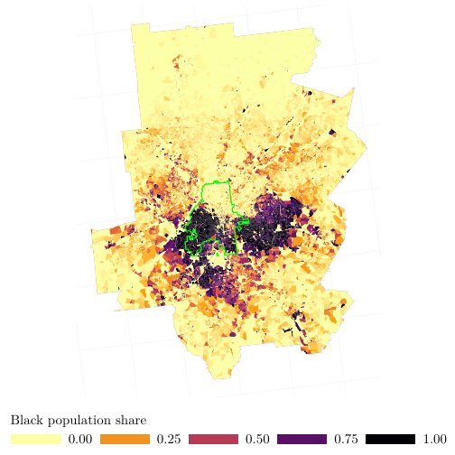

```{css, echo=FALSE}
# CSS for including pauses in printed PDF output (see bottom of lecture)
@media print {
  .has-continuation {
    display: block !important;
  }
}
```

```{css, echo=FALSE}
.center-fit {
  display: block;
  margin-left: auto;
  margin-right: auto;
  max-width: 80%;
  max-height: 10%;
}
```


```{r setup, include=FALSE}
# xaringanExtra::use_scribble() ## Draw on slides. Requires dev version of xaringanExtra.

options(htmltools.dir.version = FALSE)
library(knitr)
opts_chunk$set(
   fig.asp = 9/16,
  fig.align = 'center',
  echo = F,
  out.width = "95%",
  dpi= 300
  )

knitr::opts_chunk$set(echo=TRUE, eval=TRUE,results='hide')

Sys.setenv(lang='en')
setwd(dirname(rstudioapi::getActiveDocumentContext()$path))
library(tidyverse)
library(hrbrthemes)
library(fontawesome)
library(tidyverse)
library(ggtext)
library(lubridate)
library(here)
library(magick)
```


# Lecture's Objectives

1. [Why this course?](#motivation)

2. [Getting started](#started)

3. [What R can do?](#r4ds)

4. [Basic Introduction](#introduction)


---
class: inverse, center, middle
name: motivation

# Why this course?

<html><div style='float:left'></div><hr color='#EB811B' size=1px width=796px></html>

---

# What is R?

- R is a language and environment for statistical computing and graphics.
- **Open-source** and extensible.
- Built upon _S_, a statistical programming language.
- Rich set of packages for data manipulation (e.g., `tidyverse` environment build upon `tidyr`, `dplyr`, etc.).
- Comprehensive plotting libraries (e.g., `ggplot2`, `lattice`).
- Wide array of statistical tests.
- Facilitates machine learning algorithms.
- Excellent packages (e.g., `sf`, `terra`, etc.) for spatial datasets and GIS applications

---


# Comparison with other languages


## R vs Python

- R: More focused on statistical modeling and data visualization.
- R: Weaker on web-scraping
- Python: More general-purpose but has strong data science libraries (e.g., `pandas`, `scikit-learn`).

## R vs MATLAB

- R: Open-source and has a larger community for data science.
- MATLAB: Stronger in numerical simulation but less versatile for data manipulation.


---

#  R vs STATA

## Flexibility and Extensibility

- **R**: Highly extensible through packages; good for custom statistical methods.
- **STATA**: More rigid but user-friendly for standard statistical tests.

## Data Handling

- **R**: More versatile data manipulation capabilities (`dplyr`, `tidyr`).
- **STATA**: Efficient for large datasets but less flexibility.

## Graphics and Visualization

- **R**: Advanced graphical capabilities (`ggplot2`).
- **STATA**: Basic graphs are easier to produce but less customizable.

### Pricing and Community

- **R**: Open-source, large and active community.
- **STATA**: Commercial software, smaller community focused on social sciences.

---


# So, Why This Course?

- Provide a basic introduction to R
- In future, extend the course to advance level (_depending upon demand_)
  - Causal inference methods
  - Big data (`vroom`)
  - Webscraping 
  - Geospatial analysis
  - ...
--

- Many of these topics are not directly relevant for your specific work, but,

--

> <span style="color: red;">**Knowledge is power!**</span>


---

class: inverse, center, middle
name: started

# Getting Started

<html><div style='float:left'></div><hr color='#EB811B' size=1px width=796px></html>

---


# What you need?

## For this course:

- Install `R`
- Install `RStudio`

## Additional components

- Install `Git`
- Create a `Github` account. Alternatively, you can also create account on `Gitlab` or `Gitbucket`, but `Github` is the most used one
- If working only with `RStudio`, follow this website to get things working: [http://happygitwithr.com](http://happygitwithr.com)

- For general purpose use of `Git`, I will suggest to use `GitKraken`


---

class: inverse, center, middle
name: r4ds

# What R Can Do?

<html><div style='float:left'></div><hr color='#EB811B' size=1px width=796px></html>

---

# Let's create some figures!
<figure style="text-align: center;">

 <figcaption>NY Times, 2022-01-06, Covid Cases Spiral, US </figcaption>
</figure>

---

# Let's create some figures!
## Hats off to ByData blog!

```{r, cache = TRUE}

pacman::p_load("tidyverse", "ggtext", "here", "lubridate")
owid_url <- "https://github.com/owid/covid-19-data/blob/master/public/data/owid-covid-data.csv?raw=true"
covid <- suppressMessages(read_csv(owid_url))

# get the data only for the US
covid_cases <- covid |> 
  dplyr::filter(location == 'United States') |> 
  dplyr::select(date, new_cases, new_cases_smoothed) |> 
  dplyr::arrange(date) |> 
  
  
  
  # add some additional data to complete the year
  dplyr::add_row(date = as_date("2020-01-01"), new_cases = 0, new_cases_smoothed = 0,
          .before = 1) %>% 
  tidyr::complete(date = seq(min(.$date), max(.$date), by = 1),
           fill = list(new_cases = 0, new_cases_smoothed = 0)) %>% 
  dplyr::mutate(day_of_year = yday(date),
         year = year(date)
         )

```


---

# How a basic plot looks like?

```{r, cache=TRUE, out.width='80%',out.height='80%', fig.align='center', include=TRUE}

basic.plot <- covid_cases |> 
  ggplot() +
  geom_segment(aes(x = day_of_year, xend = day_of_year + 1, 
                   y = as.POSIXct(date), yend = as.POSIXct(date))) +
  coord_polar()
basic.plot
```
---

# How a basic plot looks like?

```{r, cache=TRUE, out.width='80%',out.height='80%', fig.align='center', include=TRUE}

basic.plot + theme_void()
```


---

# Moving onto advanced level now!

```{r, echo=FALSE, cache=TRUE, out.width='80%',out.height='80%', fig.align='center', include=TRUE}

size_factor <- 60

# Colors
outline_color <- "#D97C86"
fill_color <- "#F0C0C1"
base_grey <- "grey28"

basic.plot <- covid_cases %>% 
  ggplot() +
  # area to encode the number of cases
  geom_ribbon(aes(x = day_of_year, 
                  ymin = as.POSIXct(date) - new_cases_smoothed / 2 * size_factor,
                  ymax = as.POSIXct(date) + new_cases_smoothed / 2 * size_factor,
                  group = year),
              size = 0.3, col = outline_color, fill = fill_color, show.legend = FALSE) +
  # basic line
  geom_segment(aes(x = day_of_year, xend = day_of_year + 1, 
                   y = as.POSIXct(date), yend = as.POSIXct(date)),
               col = base_grey, size = 0.3) +
  coord_polar() +
  theme_void()
basic.plot


```
---

# Moving onto advanced level now!

```{r,  echo=TRUE, cache=TRUE, out.width='100%',out.height='80%', fig.align='center', results='hide'}

month_length <- c(31, 28, 31, 30, 31, 30,
                  31, 31, 30, 31, 30, 31)

month_breaks <- cumsum(month_length) - 30

basic.plot <-  basic.plot + scale_x_continuous(minor_breaks = month_breaks, 
                     breaks = month_breaks[c(1, 4, 7, 10)],
                     labels = c("Jan.", "April", "July", "Oct.")) +
  theme(
    plot.background = element_rect(color = NA, fill = "white"),
    panel.grid.major.x = element_line(color = "grey70", size = 0.2, linetype = "dotted"),
    panel.grid.minor.x = element_line(color = "grey70", size = 0.2, linetype = "dotted"),
    axis.text.x = element_text(color = base_grey, size = 5, hjust = 0.5),
  )

```
---

# Moving onto advanced level now!
- One truth about generating good figures: last 10 percent improvement takes 90 percent of time
```{r,  echo=TRUE, cache=TRUE, out.width='100%',out.height='80%', fig.align='center', message=FALSE, warning=FALSE, include=TRUE}

month_length <- c(31, 28, 31, 30, 31, 30,
                  31, 31, 30, 31, 30, 31)

month_breaks <- cumsum(month_length) - 30

basic.plot <-   basic.plot + scale_x_continuous(minor_breaks = month_breaks, 
                     breaks = month_breaks[c(1, 4, 7, 10)],
                     labels = c("Jan.", "April", "July", "Oct.")) +
  theme(
    plot.background = element_rect(color = NA, fill = "white"),
    panel.grid.major.x = element_line(color = "grey70", size = 0.2, linetype = "dotted"),
    panel.grid.minor.x = element_line(color = "grey70", size = 0.2, linetype = "dotted"),
    axis.text.x = element_text(color = base_grey, size = 5, hjust = 0.5),
  )


```


---

# Advanced level now

```{r,  echo=FALSE, cache=TRUE, out.width='100%',out.height='80%', fig.align='center', message=FALSE, warning=FALSE}

basic.plot <- covid_cases %>% 
  # 2020 is a leap year, we could drop Feb 29, 2020 for the sake of 365-day years
  filter(date != as_date("2020-02-29")) %>%
  group_by(year) %>%
  mutate(day_of_year = row_number()) %>%
  ungroup() %>%
  ggplot() +
  # area
  geom_ribbon(aes(x = day_of_year, 
                  ymin = as.POSIXct(date) - new_cases_smoothed / 2 * size_factor,
                  ymax = as.POSIXct(date) + new_cases_smoothed / 2 * size_factor,
                  group = year),
              color = outline_color, size = 0.3, fill = fill_color, show.legend = FALSE) +
  # basic line
  geom_segment(aes(x = day_of_year, xend = day_of_year + 1, 
                   y = as.POSIXct(date), yend = as.POSIXct(date)),
               col = base_grey, size = 0.3) +
  scale_x_continuous(minor_breaks = month_breaks, 
                     breaks = month_breaks[c(1, 4, 7, 10)],
                     labels = c("Jan.", "April", "July", "Oct."),
                     limits = c(1, 365),
                     expand = c(0, 0)
                     ) +
  #' set the lower limit of the y-axis to a date before 2020 
  #' so that the spiral does not start in the center point
  scale_y_continuous(limits = c(as.POSIXct("2019-07-01"), NA),
                     expand = c(0, 0)) +
  coord_polar() +
  theme_void() +
  theme(
    plot.background = element_rect(color = NA, fill = "white"),
    panel.grid.major.x = element_line(color = "grey70", size = 0.2, linetype = "dotted"),
    panel.grid.minor.x = element_line(color = "grey70", size = 0.2, linetype = "dotted"),
    axis.text.x = element_text(color = base_grey, size = 5, hjust = 0.5)
  )


text_color <- rgb(18, 18, 18, maxColorValue = 255)
base_family <- "Libre Franklin Medium"
# base_family <- "Helvetica"
subtitle_date <- max(covid_cases$date) %>% 
  format("%b. %d, %Y")

# Annotations for the years in a list (used in annotate())
year_annotations <- list(
  year = 2020:2023,
  x = rep(4, 4),
  y = as.POSIXct(paste(2020:2023, "01", "01", sep = "-"))
)

basic.plot <- covid_cases %>% 
  # 2020 is a leap year, we could drop Feb 29, 2020 for the sake of 365-day years
  filter(date != as_date("2020-02-29")) %>%
  group_by(year) %>%
  mutate(day_of_year = row_number()) %>%
  ungroup() %>%
  ggplot() +
  # area
  geom_ribbon(aes(x = day_of_year, 
                  ymin = as.POSIXct(date) - new_cases_smoothed / 2 * size_factor,
                  ymax = as.POSIXct(date) + new_cases_smoothed / 2 * size_factor,
                  group = year),
              color = outline_color, size = 0.3, fill = fill_color, show.legend = FALSE) +
  # basic line
  geom_segment(aes(x = day_of_year, xend = day_of_year + 1, 
                   y = as.POSIXct(date), yend = as.POSIXct(date)),
               col = base_grey, size = 0.3) +
  
 
  
  # annotation: years
  annotate("text", label = paste0(year_annotations$year, "\u2192"), x = year_annotations$x, 
           y = year_annotations$y, 
           family = "Arial",
           size = 1.5, vjust = -0.6, hjust = 0.15) +   
  
  scale_x_continuous(minor_breaks = month_breaks, 
                     breaks = month_breaks[c(1, 4, 7, 10)],
                     labels = c("Jan.", "April", "July", "Oct."),
                     limits = c(1, 365),
                     expand = c(0, 0)
                     ) +
  #' set the lower limit of the y-axis to a date before 2020 
  #' so that the spiral does not start in the center point
  scale_y_continuous(limits = c(as.POSIXct("2019-07-01"), NA),
                     expand = c(0, 0)) +
  coord_polar() +
  labs(
    subtitle = subtitle_date
  ) +
  theme_void(base_family = base_family) +
  theme(
    plot.background = element_rect(color = NA, fill = "white"),
    panel.grid.major.x = element_line(color = "grey70", size = 0.2, linetype = "dotted"),
    panel.grid.minor.x = element_line(color = "grey70", size = 0.2, linetype = "dotted"),
    axis.text.x = element_text(color = base_grey, size = 5, hjust = 0.5),
    text = element_text(color = text_color),
    plot.subtitle = element_text(hjust = 0.5, size = 5)
  )

basic.plot

```


---

# Minard's 1812 Plot
- Hats off to Andrew Heiss
- One lesson from this course: learn from best coders out there, rewrite and replicate their code
<figure style="text-align: center;">

 <figcaption>Forward and Retreat path of Napoleon's Army </figcaption>
</figure>


---


--- 

# Minard's 1812 Plot: Basic Work


```{r,  echo=TRUE,results='hide'}

pacman::p_load(tidyverse,
               lubridate,
               ggmap,
               ggrepel,
               gridExtra,
               pander)

cities <- read.table("data/cities.txt",
                     header = TRUE, stringsAsFactors = FALSE)

troops <- read.table("data/troops.txt",
                     header = TRUE, stringsAsFactors = FALSE)

temps <- read.table("data/temps.txt",
                    header = TRUE, stringsAsFactors = FALSE) |> 
  mutate(date = dmy(date))  # Convert string to actual date

```


---

# Minard's 1812 Plot: Basic Figure

```{r, echo=TRUE,cache=TRUE, out.width='100%',out.height='70%', fig.align='center', message=FALSE, warning=FALSE}
ggplot(troops, aes(x = long, y = lat, group = group)) +
  geom_path()
```

---

# Minard's 1812 Plot: Basic Figure
```{r, echo=FALSE,cache=TRUE, out.width='100%',out.height='70%', fig.align='center', message=FALSE, warning=FALSE}
ggplot(troops, aes(x = long, y = lat, group = group, 
                   color = direction, size = survivors)) +
  geom_path(lineend = "round")
```


---

# Minard's 1812 Plot: Bit more
```{r, echo=FALSE,cache=TRUE, out.width='100%',out.height='70%', fig.align='center', message=FALSE, warning=FALSE}
ggplot(troops, aes(x = long, y = lat, group = group, 
                   color = direction, size = survivors)) +
  geom_path(lineend = "round") +
  scale_size(range = c(0.5, 15))
```


---

# Minard's 1812 Plot: Bit more
```{r, echo=FALSE,cache=TRUE, out.width='100%',out.height='70%', fig.align='center', message=FALSE, warning=FALSE}
ggplot() +
  geom_path(data = troops, aes(x = long, y = lat, group = group, 
                               color = direction, size = survivors),
            lineend = "round") +
  geom_point(data = cities, aes(x = long, y = lat)) +
  geom_text(data = cities, aes(x = long, y = lat, label = city), vjust = 1.5) +
  scale_size(range = c(0.5, 15)) + 
  scale_colour_manual(values = c("#DFC17E", "#252523")) +
  labs(x = NULL, y = NULL) + 
  guides(color = FALSE, size = FALSE)
```


---

# Minard's 1812 Plot: Bring Spatial Map
```{r, echo=FALSE,cache=TRUE, out.width='100%',out.height='70%', fig.align='center', message=FALSE, warning=FALSE}
march.1812.europe <- c(left = -13.10, bottom = 35.75, right = 41.04, top = 61.86)

# "zoom" ranges from 3 (continent) to 21 (building)
# "where" is a path to a folder where the downloaded tiles are cached
march.1812.europe.map <- get_stamenmap(bbox = march.1812.europe, zoom = 5,
                                       maptype = "terrain", where = "cache")

ggmap(march.1812.europe.map)
```


---

# Minard's 1812 Plot: Watercolor
```{r, echo=FALSE,cache=TRUE, out.width='100%',out.height='70%', fig.align='center', message=FALSE, warning=FALSE}
march.1812.europe.map.wc <- get_stamenmap(bbox = march.1812.europe, zoom = 5,
                                          maptype = "watercolor", where = "cache")
ggmap(march.1812.europe.map.wc)
```


---

# Minard's 1812 Plot: Overlay
```{r, echo=FALSE,cache=TRUE, out.width='100%',out.height='70%', fig.align='center', message=FALSE, warning=FALSE}
ggmap(march.1812.europe.map.wc) +
  geom_path(data = troops, aes(x = long, y = lat, group = group, 
                               color = direction, size = survivors),
            lineend = "round") +
  scale_size(range = c(0.5, 5)) + 
  scale_colour_manual(values = c("#DFC17E", "#252523")) +
  guides(color = FALSE, size = FALSE) +
  theme_nothing() 
```


---

# Spatial Map: My Own Plot

<figure style="text-align: center;">

 <figcaption>Atlanta Black population share at the block level </figcaption>
</figure>


--- 


class: inverse, center, middle
name: introduction

# Basic Introduction

<html><div style='float:left'></div><hr color='#EB811B' size=1px width=796px></html>

---


# What is R?

- R is a language and environment for statistical computing and graphics.
- **Open-source** and extensible.
- Built upon _S_, a statistical programming language.
- Rich set of packages for data manipulation (e.g., `tidyverse` environment build upon `tidyr`, `dplyr`, etc.).
- Comprehensive plotting libraries (e.g., `ggplot2`, `lattice`).
- Wide array of statistical tests.
- Facilitates machine learning algorithms.
- Excellent packages (e.g., `sf`, `terra`, etc.) for spatial datasets and GIS applications

---


# General Guidelines

* Use a different folder for each new project / assignment.
* Set the Working Directory for R at the beginning of each project
* Always use script files to keep a record of your work
* Initialize a Git repository in each project folder (unless the project is very small).


## My own example folder

- `root/`
  - _master.R_
  - `auxfiles/`
      - _auxfiles/script1.R_
      - _auxfiles/script2.R_
  - `Data/` (stores raw data, use _.gitignore_ to ignore the content of this folder to _Git_)
      - _Data/rawdata1.dta_ 
      - ...
  - `Output/` (stores compiled, cleaned data, use _.gitignore_)
      - _Output/tables/_  (stores estimation, descriptive tables)
      - _Output/Figures/_  (stores figures, can  use _.gitignore_)
  
---

# How `master.R` looks like?

- This file sets up the environment where your code will run

```{r, eval=FALSE, include=T, cache=TRUE}

#clean up the memory
rm(list=ls())
gc()


#set up the language of your error message
Sys.setenv(lang='en')

#most important: set up your working directory
#all paths are relative to this
setwd(dirname(rstudioapi::getActiveDocumentContext()$path))

```

---


# How `master.R` looks like?

```{r, eval=FALSE, include=T, cache=TRUE}

#install pacman package, if not available always include this line, as your co-author 
#might not have pacman
if (!require(pacman)) {
  install.packages('pacman', dependencies = T)
}

#load other packages you might need
pacman::p_load(tidyverse,
               hrbethemes,
               fontawesome,
               tidyverse,
               ggtext,
               lubridate,
               here,
               magick)


```


---

# What is a package?

- An R package is a collection of R functions, data, and documentation that can be installed and used by other R users.
    - Packages are a way to organize and distribute code, data, and documentation
    
- General working with packages:
    - `install.packages('tidyverse')`
        - This command already finds a mirror to download the package
    - `install.packages('tidyverse', repos='http://cran.us.r-project.org/', dependencies=TRUE)`
        - You are specifying a specific mirror
- I will suggest to use `pacman` (see the previous slide)

--

- Sometimes two different packages have a conflict:
    - they contain functions with same name
    - `R` will resolve it by selecting one function to _mask_ another
    - If not careful, you can make error
- If loading two packages which have a conflict, try to use `::`
    


---


# Variables in _R_

- R uses symbolic variables: words, letters, and their combination
- These variables either _represent_ or _store_ values/objects
- **How it works?** Use of _assignment operator_ (`<-`) 

```{r,  include=TRUE, eval=TRUE, results='asis', cache=TRUE}

n <- 5
n

numVar <- 10
numVar


```


---


# Variables in _R_

- R uses symbolic variables: words, letters, and their combination
- These variables either _represent_ or _store_ values/objects
- **How it works?** Use of _assignment operator_ (`<-`) 
    - Don't use `=` for assignment
    - Most of the time it will work, but in `R` it is a bad practice

```{r,  include=TRUE, eval=TRUE, results='asis', cache=TRUE}

stringVar <- 'Hello World, I am R'
stringVar 


boolVar <- TRUE
boolVar


newVar <-  boolVar + 3
newVar 


```

---

# Variable naming etiquette

- We always work in a team
- Your code will be read by someone else
- Two rules for naming variables:
    - Give _**meaningful**_ name to each variable
    - Make sure the name is _**readable**_
- Read this: [Google Style Guide for R Programming](https://google.github.io/styleguide/Rguide.html)

---

# Functions

- We are not going to use `R` as a calculator
    - You can, but it is an inefficient use of `R`
    
- You are in this course to **up** your `Data` and `Statistics` work

- `R` allows you to do complicated things in an easy way

- We need `functions` for that

- _What is a function?_
    - A set of routine, you write once, use indefinitely
    - You can share this routine  with other people also
        -  Think of `package`: just a bunch of functions, packaged  together, which can be used by anyone in the world
        
---

# Functions

- Generic representation of functions

```{r, eval=F, include=T, cache=TRUE}

function_name <- function(input1 , input2) {
  
  # Use `input1` and `input2` along with other functions and variable to
  # do your work
  
  
}  #end of function_name

```

---

# Functions


- **Example:**  
    - `sum`, inbuilt function of `R`
    - takes numbers and returns their total

```{r, eval=FALSE, echo=TRUE, cache=TRUE}

sum <- function(number1, number2) {
  
  total <- number1 + number2
  return(total)
  
} #end function sum

```


- _Note:_ There is no default values for `number1` and `number2`


```{r, eval=FALSE, echo=TRUE, cache=TRUE}

sumDefault <- function(number1=0, number2=1) {
  
  total <- number1 + number2
  return(total)
  
} #end function sumDefault

```


---

#  Functions

- How about writing a function where we can pass a vector?

```{r, echo=TRUE, eval=FALSE, cache=TRUE}

sumVector <- function(vector_to_sum) {
  
  n <- length(vector_to_sum)
  
  total <- 0
  
  for(iter in 1:n){
    total <- total + vector_to_sum[iter]
  }
  
  return(total)
  
  
} #end function sumVector

```

---


class: inverse, center, middle
name: data_structures

# R Data Structures

<html><div style='float:left'></div><hr color='#EB811B' size=1px width=796px></html>

---


# Data _types_ and _structures_

- `R` has six data types
    - character
    - numeric
    - integer
    - logical 
    - complex
    - _raw_ (rarely used)
    
- Combination of data types $\rightarrow$ data structures

- Data structures can be 
    - atomic vectors: the vector hold data only of a single type
    - non-atomic vectors i.e. `lists`: holds data of a multiple type
        - `lists` are one of the most powerful feature of `R`

---

# Data _types_ and _structures_

- Functions provided by `R` to examine what does a `vector` contains
    - `class()`
    - `typeof()`
    - `length()`
    - `attributes()`

- **Example** 

```{r, include=TRUE,results='asis', cache=TRUE}
x <- 'swapnil singh'

class(x)

typeof(x)

```


---

# Data _types_ and _structures_

- Functions provided by `R` to examine what does a `vector` contains
    - `class()`
    - `typeof()`
    - `length()`
    - `attributes()`

- **Example** 

```{r, include=TRUE,results='asis', cache=TRUE}
num <- c(1,2,3,4,5,6)

class(num)

typeof(num)


```

    
  

---

# Data _types_ and _structures_

- Functions provided by `R` to examine what does a `vector` contains
    - `class()`
    - `typeof()`
    - `length()`
    - `attributes()`

- **Example** 

```{r, include=TRUE,results='asis', cache=TRUE}
num <- c(1,2,3,4,5,6)


length(num)

attributes(num)

```

---

# Vectors

- Two types of vectors:
    - _**atomic vector:**_ contain element of same type
    - _**lists:**_ the most important thing in _R_

---

# Atomic vector


```{r, include=TRUE,results='markup', cache=TRUE}

#default initialization of vector
vector()
```
--

```{r, include=TRUE, results='markup', cache=TRUE}
#vector of type character
vector('character', length = 3)   
```

--

```{r, include=TRUE, results='markup', cache=TRUE}
#use the character constructor, instead of vector
character(3)
numeric(7)
logical(5)
```


---
---

# Atomic Vector 

- Another way to create vector: use function `c`

```{r,include=TRUE, results='markup', cache=TRUE}


numericVec <- c(0,1,3,4)
numericVec
logicalVec <- c(TRUE,FALSE,FALSE, TRUE)
logicalVec
characterVec <- c('Swapnil', "R Course", 'LB')
characterVec
# Add element to vector
characterVec <- c(characterVec, 'October')
characterVec
```


---

# Atomic Vector - Missing Data

- A vector can contain missing data, reported by `NA`
- Does not matter the type of vector
```{r, include=TRUE, results='markup', cache=TRUE}
presidentName <- c('Biden', 'Obama', NA, 'Bush')
presidentName

#find the missing element
pnameNA <- is.na(presidentName)
pnameNA

whichNameNA <- which(is.na(presidentName))
whichNameNA
```


---

# Lists

```{r, include=TRUE, results='markup', cache=TRUE}
#unnamed list
unnamedList <- list('my name is Swapnil Singh',
                    35,
                    'economist')

unnamedList 

```

- Access elements of list

```{r, include=TRUE, results='markup', cache=TRUE}
unnamedList[[1]][1]
```


---


# Lists

```{r, include=TRUE, results='markup', cache=TRUE}
#unnamed list
unnamedList <- list(c('my name is Swapnil Singh', 'I work at LB'),
                    35,
                    'economist')

unnamedList 

```


---

# Lists

```{r, include=TRUE, results='markup', cache=TRUE}

#named list
namedList <- list(intro = 'my name is Swapnil Singh',
                  age = 35,
                  profession = 'economist')
namedList

namedList$intro
namedList[['age']]
```


---

# Data Frame

- Core of `data science` in `R`
- It is actually a `list` where each element of list has same length
- Let's take the previous example


```{r, include=TRUE, results='markup', cache=TRUE}
#unnamed list
unnamedList <- list(c('my name is Swapnil Singh', 'I work at LB'),
                    35,
                    'economist')
#first element has different length than other two
length(unnamedList[[1]]) 
length(unnamedList[[2]]) 
length(unnamedList[[3]]) 
```


---


# Data Frame

- Work with dataframe `CO2`


```{r, include=TRUE, results='markup', cache=TRUE}
#ugly output
CO2
```


---


# Data Frame

- Work with dataframe `CO2`


```{r, include=TRUE, results='markup', cache=TRUE}
#better output: show first six rows or last six rows
head(CO2)
tail(CO2)

```


---

# Data Frame

```{r, include=TRUE, results='markup'}
#better output: dimensions of the data frame
#number of rows and columns
dim(CO2)

nrow(CO2)
ncol(CO2)

names(CO2)
colnames(CO2)
```


---

# Class Exercise: Data Frame

- Load `LifeCycleSavings` data in your `R` work environment
--
```{r, include=TRUE, results='markup', cache=TRUE}
dataLifeCycle <- LifeCycleSavings
dataLifeCycle
```


---

# Class Exercise: Data Frame

- Load `LifeCycleSavings` data in your `R` work environment
- Extract the column names and put  it in a variable `cnames`
--
```{r, include=TRUE, results='markup', cache=TRUE}
dataLifeCycle <- LifeCycleSavings
cnames <- colnames(dataLifeCycle)
cnames
```


---

# Class Exercise: Data Frame

- Load `LifeCycleSavings` data in your `R` work environment
- Extract the column names and put  it in a variable `cnames`
- Show the first eight rows of the loaded data
--
```{r, include=TRUE, results='markup', cache=TRUE}
dataLifeCycle <- LifeCycleSavings
head(dataLifeCycle, n = 8)
```


---

# Class Exercise: Data Frame

- Load `LifeCycleSavings` data in your `R` work environment
- Extract the column names and put  it in a variable `cnames`
- Show the first eight rows of the loaded data
- Show the last three rows of the loaded data
--
```{r, include=TRUE, results='markup', cache=TRUE}
dataLifeCycle <- LifeCycleSavings
tail(dataLifeCycle, n = 3)
```


---

# Class Exercise: Data Frame

- Load `LifeCycleSavings` data in your `R` work environment
- Extract the column names and put  it in a variable `cnames`
- Show the first eight rows of the loaded data
- Show the last three rows of the loaded data
- Construct a new column `pop15_75` which is sum of `pop15` and `pop75`
--
```{r, include=TRUE, results='markup'}
dataLifeCycle <- LifeCycleSavings
dataLifeCycle$pop15_75 <- dataLifeCycle$pop15 + dataLifeCycle$pop75
head(dataLifeCycle)
```


---


class: inverse, center, middle
name: tidyverse

# tidyverse + ggplot

<html><div style='float:left'></div><hr color='#EB811B' size=1px width=796px></html>

---


# Introduction

- For reference: [`R for Data Science (2e)`](https://r4ds.hadley.nz/)
- I will 
  - Provide a quick tour of `tidy` environment
  - Introduce `pipes`
  - Spend a lot of time on data visualization
  - Spend sometime introducing `RMarkdown`
    
- I  will **not**  introduce statistical analysis and methods
  - No time
    


---

# Workflow

<figure style="text-align: center;">

 <figcaption>Source: R4DS 2e </figcaption>
</figure>

- We will cover `Import`, `Tidy`, `Transform`, `Visualize`, and `Communicate`
- `Model` part will not be covered


---

# Start of the workflow

- You got the data
- First thing you do: try to `feel` it
  - Do some basic plots
  - Understand the type of variables it has
  - ...
- To plot, we will use `ggplot` package
  - loads with `tidyverse` package automatically
- `ggplot`: (G)rammar of (G)raphics plot
  - can only be used with `dataframes`

```{r, include=TRUE, eval=TRUE, results='hide', cache=TRUE}
pacman::p_load(tidyverse,
               palmerpenguins,
               ggthemes)
```

- We use `palmerpenguins` data

---

# palmerpenguins data

- Description here: [`palmer penguins data`](https://allisonhorst.github.io/palmerpenguins/)
- Contains two datasets: `penguins` and `penguins_raw`

```{r, include=TRUE, results='markup', cache=TRUE}
head(penguins)
dim(penguins)
```


---

# palmerpenguins data

- Description here: [`palmer penguins data`](https://allisonhorst.github.io/palmerpenguins/)
- Contains two datasets: `penguins` and `penguins_raw`

```{r, include=TRUE, results='markup', cache=TRUE}
glimpse(penguins)
```

---

# palmerpenguins data - plotting

- What is the relationship between flipper length (`flipper_length_mm`) and body mass (`body_mass_g`)  of penguins?
- Step by step, follow me by writing your own version
- `ggplot` works in layers 

---

# palmerpenguins data - plotting

```{r, include=TRUE, cache=TRUE}
ggplot(data = penguins)
```


---

# palmerpenguins data - plotting

```{r, include=TRUE, cache=TRUE}
ggplot(data = penguins, aes(x = flipper_length_mm, y = body_mass_g))
```


---

# palmerpenguins data - plotting

```{r, include=TRUE, cache=TRUE, warning=FALSE}
ggplot(data = penguins, aes(x = flipper_length_mm, y = body_mass_g)) +
  geom_point()
```


---

# palmerpenguins data - plotting

```{r, include=TRUE, cache=TRUE, warning=FALSE}
ggplot(data = penguins, aes(x = flipper_length_mm, y = body_mass_g, color=species)) +
  geom_point()
```


---

# palmerpenguins data - plotting

```{r, include=TRUE, cache=TRUE, warning=FALSE, message=FALSE}
ggplot(data = penguins, aes(x = flipper_length_mm, y = body_mass_g, color=species)) +
  geom_point() +
  #add linear fit (three separate lines for each group)
  geom_smooth(method='lm') 
```


# palmerpenguins data - plotting

```{r, include=FALSE,echo=TRUE, cache=TRUE, warning=FALSE, message=FALSE, eval=FALSE}
ggplot(data = penguins, aes(x = flipper_length_mm, y = body_mass_g)) +
  geom_point(mapping = aes(color=species)) +
  #add linear fit (three separate lines for each group)
  geom_smooth(method='lm') 
```

---


# palmerpenguins data - plotting


```{r, echo = TRUE, cache=TRUE, warning=FALSE, message=FALSE, eval=FALSE}
p <-  ggplot(data = penguins, aes(x = flipper_length_mm, y = body_mass_g)) +
  
  
  # notice how `aes` for geom_point shifted from above to here
  geom_point(mapping = aes(color=species)) +
  
  
  #add linear fit (one line across all three groups)
  geom_smooth(method='lm') 
```

---

# palmerpenguins data - plotting


```{r, echo = FALSE, cache=TRUE, warning=FALSE, message=FALSE, eval=TRUE}
p <-  ggplot(data = penguins, aes(x = flipper_length_mm, y = body_mass_g)) +
  
  
  # notice how `aes` for geom_point shifted from above to here
  geom_point(mapping = aes(color=species)) +
  
  
  #add linear fit (one line across all three groups)
  geom_smooth(method='lm') 

p
```


---


# palmerpenguins data - plotting

- Different shapes for each species

```{r, echo = TRUE, cache=TRUE, warning=FALSE, message=FALSE, eval=FALSE}
p <-  ggplot(data = penguins, aes(x = flipper_length_mm, y = body_mass_g)) +
  
  
  # notice how `aes` for geom_point shifted from above to here
  geom_point(mapping = aes(color=species, shape=species)) +
  
  
  #add linear fit (one line across all three groups)
  geom_smooth(method='lm') 

p
```


---


# palmerpenguins data - plotting

- Different shapes for each species

```{r, echo = FALSE, cache=TRUE, warning=FALSE, message=FALSE, eval=TRUE}
p <-  ggplot(data = penguins, aes(x = flipper_length_mm, y = body_mass_g)) +
  
  
  # notice how `aes` for geom_point shifted from above to here
  geom_point(mapping = aes(color=species, shape=species)) +
  
  
  #add linear fit (one line across all three groups)
  geom_smooth(method='lm') 

p
```


---


# palmerpenguins data - plotting

- Add a new layer for axis and plot titles

```{r, echo = TRUE, cache=TRUE, warning=FALSE, message=FALSE, eval=FALSE}
p <-  ggplot(data = penguins, aes(x = flipper_length_mm, y = body_mass_g)) +
  
  
  # notice how `aes` for geom_point shifted from above to here
  geom_point(mapping = aes(color=species, shape=species)) +
  
  
  #add linear fit (one line across all three groups)
  geom_smooth(method='lm')  +
  
  labs(
    title = "Penguins: relationship between body mass and flipper length",
    subtitle = "Adelie, Chinstrap, and Gentoo Penguins",
    x = "flipper length in millimeters",
    y = "body mass in grams",
    color = "species",
    shape = "species"
  )

p
```


---


# palmerpenguins data - plotting

- Add a new layer for axis and plot titles

```{r, echo = FALSE, cache=TRUE, warning=FALSE, message=FALSE, eval=TRUE}
p <-  ggplot(data = penguins, aes(x = flipper_length_mm, y = body_mass_g)) +
  
  
  # notice how `aes` for geom_point shifted from above to here
  geom_point(mapping = aes(color=species, shape=species)) +
  
  
  #add linear fit (one line across all three groups)
  geom_smooth(method='lm')  +
  labs(
    title = "Relationship between body mass and flipper length",
    subtitle = "Adelie, Chinstrap, and Gentoo Penguins",
    x = "flipper length in millimeters",
    y = "body mass in grams",
    color = "species",
    shape = "species"
  )

p
```


---


# palmerpenguins data - plotting

- Change the theme of the plot

```{r, echo = TRUE, cache=TRUE, warning=FALSE, message=FALSE, eval=FALSE}
p <-  ggplot(data = penguins, aes(x = flipper_length_mm, y = body_mass_g)) +
  
  
  # notice how `aes` for geom_point shifted from above to here
  geom_point(mapping = aes(color=species, shape=species)) +
  
  
  #add linear fit (one line across all three groups)
  geom_smooth(method='lm')  +
  
  #modern theme
  theme_modern_rc() +
  
  labs(
    title = "Penguins: relationship between body mass and flipper length",
    subtitle = "Adelie, Chinstrap, and Gentoo Penguins",
    x = "flipper length in millimeters",
    y = "body mass in grams",
    color = "species",
    shape = "species"
  )

p
```


---


# palmerpenguins data - plotting

- Change the theme of the plot

```{r, echo = FALSE, cache=TRUE, warning=FALSE, message=FALSE, eval=TRUE}
p <-  ggplot(data = penguins, aes(x = flipper_length_mm, y = body_mass_g)) +
  
  
  # notice how `aes` for geom_point shifted from above to here
  geom_point(mapping = aes(color=species, shape=species)) +
  
  
  #add linear fit (one line across all three groups)
  geom_smooth(method='lm')  +
  
  #modern theme
  theme_modern_rc() +
  
  labs(
    title = "Penguins: relationship between body mass and flipper length",
    subtitle = "Adelie, Chinstrap, and Gentoo Penguins",
    x = "flipper length in millimeters",
    y = "body mass in grams",
    color = "species",
    shape = "species"
  )

p
```


---


# End of Lecture 1

- We learned 
    - basic principles of `R`
    - aesthetic (`aes`) mapping of `ggplot`
    - basic understanding of lists
    
- Next class
    - digging deeper into `tidyverse` environment
    - learn about `pipes`
    - understanding the concept of `tidy` data
        - `pivot`
    
    
    

```{r gen_pdf, include = FALSE, cache = FALSE, eval = TRUE}
infile = list.files(pattern = '.html')
pagedown::chrome_print(input = infile, timeout = 100)
```